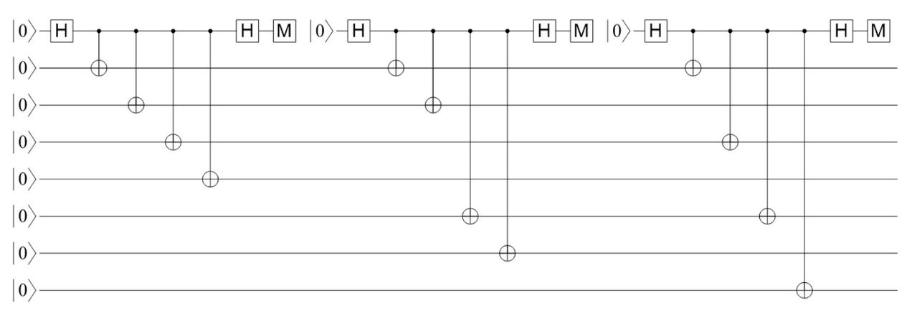

Steane Compilation in ``PyZX``
==============================

This notebook demonstrates the compilation of a :math:`7`-qubit Steane code in ``PyZX``.

    Steane Code Preparation Circuit

Step by step

To construct a graph of the circuit

.. jupyter-execute::
    :hide-code:

    import pyzx as zx
    zx.settings.colors = zx.rgb_colors
    g =  zx.Graph()
    num_qubits = 10

    # initialize the qubits
    # first three are ancillas
    for i in range(num_qubits):
        g.add_vertex(zx.VertexType.X, i, i)

    g.add_vertex(zx.VertexType.H_BOX, 0, 10)
    g.add_edge((0, 10))

    g.add_vertex(zx.VertexType.H_BOX, 1, 11)
    g.add_edge((1, 11))

    g.add_vertex(zx.VertexType.H_BOX, 2, 12)
    g.add_edge((2, 12))

    # add z nodes to the first ancilla
    g.add_vertex(zx.VertexType.Z, 10, 13)
    g.add_edge((10, 13))

    g.add_vertex(zx.VertexType.Z, 13, 14)
    g.add_edge((13, 14))

    g.add_vertex(zx.VertexType.Z, 14, 15)
    g.add_edge((14, 15))

    g.add_vertex(zx.VertexType.Z, 15, 16)
    g.add_edge((15, 16))

    g.add_vertex(zx.VertexType.H_BOX, 16, 17)
    g.add_edge((16, 17))

    g.add_vertex(zx.VertexType.X, 17, 18)
    g.add_edge((17, 18))

    # add z nodes to the second ancilla
    g.add_vertex(zx.VertexType.Z, 11, 19)
    g.add_edge((11, 19))

    g.add_vertex(zx.VertexType.Z, 19, 20)
    g.add_edge((19, 20))

    g.add_vertex(zx.VertexType.Z, 20, 21)
    g.add_edge((20, 21))

    g.add_vertex(zx.VertexType.Z, 21, 22)
    g.add_edge((21, 22))

    g.add_vertex(zx.VertexType.H_BOX, 22, 23)
    g.add_edge((22, 23))

    g.add_vertex(zx.VertexType.X, 23, 24)
    g.add_edge((23, 24))

    # add z nodes to the third ancilla
    g.add_vertex(zx.VertexType.Z, 12, 25)
    g.add_edge((12, 25))

    g.add_vertex(zx.VertexType.Z, 25, 26)
    g.add_edge((25, 26))

    g.add_vertex(zx.VertexType.Z, 26, 27)
    g.add_edge((26, 27))

    g.add_vertex(zx.VertexType.Z, 27, 28)
    g.add_edge((27, 28))

    g.add_vertex(zx.VertexType.H_BOX, 28, 29)
    g.add_edge((28, 29))

    g.add_vertex(zx.VertexType.X, 29, 30)
    g.add_edge((29, 30))

    # add cnot targets for the first ancilla
    g.add_vertex(zx.VertexType.X, 3, 31)
    g.add_edge((3, 31))
    g.add_edge((13, 31))

    g.add_vertex(zx.VertexType.X, 4, 32)
    g.add_edge((4, 32))
    g.add_edge((14, 32))

    g.add_vertex(zx.VertexType.X, 5, 33)
    g.add_edge((5, 33))
    g.add_edge((15, 33))

    g.add_vertex(zx.VertexType.X, 6, 34)
    g.add_edge((6, 34))
    g.add_edge((16, 34))

    # add cnot targets for the second ancilla
    g.add_vertex(zx.VertexType.X, 3, 35)
    g.add_edge((31, 35))
    g.add_edge((19, 35))

    g.add_vertex(zx.VertexType.X, 4, 36)
    g.add_edge((32, 36))
    g.add_edge((20, 36))

    g.add_vertex(zx.VertexType.X, 7, 37)
    g.add_edge((7, 37))
    g.add_edge((21, 37))

    g.add_vertex(zx.VertexType.X, 8, 38)
    g.add_edge((8, 38))
    g.add_edge((22, 38))

    # add cnot targets for the third ancilla
    g.add_vertex(zx.VertexType.X, 3, 39)
    g.add_edge((35, 39))
    g.add_edge((25, 39))

    g.add_vertex(zx.VertexType.X, 5, 40)
    g.add_edge((33, 40))
    g.add_edge((26, 40))

    g.add_vertex(zx.VertexType.X, 7, 41)
    g.add_edge((37, 41))
    g.add_edge((27, 41))

    g.add_vertex(zx.VertexType.X, 9, 42)
    g.add_edge((9, 42))
    g.add_edge((28, 42))

    # 39, 36, 40, 34, 41, 38, 42
    g.add_vertex(zx.VertexType.BOUNDARY, 39, 43)
    g.add_edge((39, 43))

    g.add_vertex(zx.VertexType.BOUNDARY, 36, 44)
    g.add_edge((36, 44))

    g.add_vertex(zx.VertexType.BOUNDARY, 40, 45)
    g.add_edge((40, 45))

    g.add_vertex(zx.VertexType.BOUNDARY, 34, 46)
    g.add_edge((34, 46))

    g.add_vertex(zx.VertexType.BOUNDARY, 41, 47)
    g.add_edge((41, 47))

    g.add_vertex(zx.VertexType.BOUNDARY, 38, 48)
    g.add_edge((38, 48))

    g.add_vertex(zx.VertexType.BOUNDARY, 42, 49)
    g.add_edge((42, 49))

    zx.draw(g, labels = True)

.. jupyter-execute::

    zx.hsimplify.from_hypergraph_form(g)
    zx.draw(g, labels = True)

.. jupyter-execute::

    zx.basicrules.color_change(g, 0)
    zx.basicrules.color_change(g, 1)
    zx.basicrules.color_change(g, 2)

    zx.basicrules.color_change(g, 18)
    zx.basicrules.color_change(g, 24)
    zx.basicrules.color_change(g, 30)

    zx.draw(g, labels=True)

.. jupyter-execute::

    zx.simplify.spider_simp(g)
    zx.draw(g, labels=True, auto_layout=True)

.. jupyter-execute::

    identity_node_list = []
    for i in range(len(zx.rules.match_ids_parallel(g))):
        node_i = zx.rules.match_ids_parallel(g)[i][0]
        identity_node_list.append(node_i)

    identity_node_list

.. jupyter-execute::

    for i in identity_node_list:
        zx.basicrules.remove_id(g, i)

    zx.draw(g, labels=True, auto_layout=True)

From Aleks

.. jupyter-execute::
    :hide-code:

    import pyzx as zx
    zx.settings.colors = zx.rgb_colors
    g =  zx.Graph()
    num_qubits = 10

    # initialize the qubits
    # first three are ancillas
    for i in range(num_qubits):
        g.add_vertex(zx.VertexType.X, i, i)

    g.add_vertex(zx.VertexType.H_BOX, 0, 10)
    g.add_edge((0, 10))

    g.add_vertex(zx.VertexType.H_BOX, 1, 11)
    g.add_edge((1, 11))

    g.add_vertex(zx.VertexType.H_BOX, 2, 12)
    g.add_edge((2, 12))

    # add z nodes to the first ancilla
    g.add_vertex(zx.VertexType.Z, 10, 13)
    g.add_edge((10, 13))

    g.add_vertex(zx.VertexType.Z, 13, 14)
    g.add_edge((13, 14))

    g.add_vertex(zx.VertexType.Z, 14, 15)
    g.add_edge((14, 15))

    g.add_vertex(zx.VertexType.Z, 15, 16)
    g.add_edge((15, 16))

    g.add_vertex(zx.VertexType.H_BOX, 16, 17)
    g.add_edge((16, 17))

    g.add_vertex(zx.VertexType.X, 17, 18)
    g.add_edge((17, 18))

    # add z nodes to the second ancilla
    g.add_vertex(zx.VertexType.Z, 11, 19)
    g.add_edge((11, 19))

    g.add_vertex(zx.VertexType.Z, 19, 20)
    g.add_edge((19, 20))

    g.add_vertex(zx.VertexType.Z, 20, 21)
    g.add_edge((20, 21))

    g.add_vertex(zx.VertexType.Z, 21, 22)
    g.add_edge((21, 22))

    g.add_vertex(zx.VertexType.H_BOX, 22, 23)
    g.add_edge((22, 23))

    g.add_vertex(zx.VertexType.X, 23, 24)
    g.add_edge((23, 24))

    # add z nodes to the third ancilla
    g.add_vertex(zx.VertexType.Z, 12, 25)
    g.add_edge((12, 25))

    g.add_vertex(zx.VertexType.Z, 25, 26)
    g.add_edge((25, 26))

    g.add_vertex(zx.VertexType.Z, 26, 27)
    g.add_edge((26, 27))

    g.add_vertex(zx.VertexType.Z, 27, 28)
    g.add_edge((27, 28))

    g.add_vertex(zx.VertexType.H_BOX, 28, 29)
    g.add_edge((28, 29))

    g.add_vertex(zx.VertexType.X, 29, 30)
    g.add_edge((29, 30))

    # add cnot targets for the first ancilla
    g.add_vertex(zx.VertexType.X, 3, 31)
    g.add_edge((3, 31))
    g.add_edge((13, 31))

    g.add_vertex(zx.VertexType.X, 4, 32)
    g.add_edge((4, 32))
    g.add_edge((14, 32))

    g.add_vertex(zx.VertexType.X, 5, 33)
    g.add_edge((5, 33))
    g.add_edge((15, 33))

    g.add_vertex(zx.VertexType.X, 6, 34)
    g.add_edge((6, 34))
    g.add_edge((16, 34))

    # add cnot targets for the second ancilla
    g.add_vertex(zx.VertexType.X, 3, 35)
    g.add_edge((31, 35))
    g.add_edge((19, 35))

    g.add_vertex(zx.VertexType.X, 4, 36)
    g.add_edge((32, 36))
    g.add_edge((20, 36))

    g.add_vertex(zx.VertexType.X, 7, 37)
    g.add_edge((7, 37))
    g.add_edge((21, 37))

    g.add_vertex(zx.VertexType.X, 8, 38)
    g.add_edge((8, 38))
    g.add_edge((22, 38))

    # add cnot targets for the third ancilla
    g.add_vertex(zx.VertexType.X, 3, 39)
    g.add_edge((35, 39))
    g.add_edge((25, 39))

    g.add_vertex(zx.VertexType.X, 5, 40)
    g.add_edge((33, 40))
    g.add_edge((26, 40))

    g.add_vertex(zx.VertexType.X, 7, 41)
    g.add_edge((37, 41))
    g.add_edge((27, 41))

    g.add_vertex(zx.VertexType.X, 9, 42)
    g.add_edge((9, 42))
    g.add_edge((28, 42))

    # 39, 36, 40, 34, 41, 38, 42
    g.add_vertex(zx.VertexType.BOUNDARY, 39, 43)
    g.add_edge((39, 43))

    g.add_vertex(zx.VertexType.BOUNDARY, 36, 44)
    g.add_edge((36, 44))

    g.add_vertex(zx.VertexType.BOUNDARY, 40, 45)
    g.add_edge((40, 45))

    g.add_vertex(zx.VertexType.BOUNDARY, 34, 46)
    g.add_edge((34, 46))

    g.add_vertex(zx.VertexType.BOUNDARY, 41, 47)
    g.add_edge((41, 47))

    g.add_vertex(zx.VertexType.BOUNDARY, 38, 48)
    g.add_edge((38, 48))

    g.add_vertex(zx.VertexType.BOUNDARY, 42, 49)
    g.add_edge((42, 49))

    zx.draw(g, labels = True)

.. jupyter-execute::

    zx.hsimplify.from_hypergraph_form(g)
    zx.draw(g, labels = True)

.. jupyter-execute::

    import random

    zx.full_reduce(g)
    zx.to_rg(g)

    random.seed(101)
    zx.draw(g, auto_layout=True, labels = True)
